<div align="center">

# Claude в Telegram

**Claude Code, которым управляешь с телефона.**
Настоящий агент, настоящие инструменты — а каждое разрешение приходит кнопкой в чат.

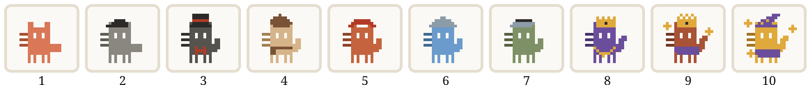

</div>

---

## Что это

Бот поднимает полноценную сессию [Claude Agent SDK](https://code.claude.com/docs/en/agent-sdk/overview) — те же инструменты, тот же агентный цикл, те же скиллы и `CLAUDE.md`, что и в терминале. Отличие одно: там, где Claude Code рисует в терминале запрос разрешения, бот присылает карточку с кнопками.

```
🖥️  Claude wants to run rm -rf node_modules

    Пересобрать зависимости с нуля

    ┌────────────────────────────────┐
    │ rm -rf node_modules            │
    └────────────────────────────────┘

    [ ✅ Разрешить ]   [ 🚫 Отклонить ]
    [ ♾️ Всегда разрешать это        ]
    [ ✍️ Отклонить и объяснить ] [ ⏹️ Стоп ]
```

Агент стоит и ждёт нажатия столько, сколько нужно — документация SDK прямо разрешает держать колбэк разрешения открытым сколь угодно долго.

## Возможности

| | |
|---|---|
| **Живая сессия на чат** | Один `query()` со streaming input держит диалог открытым. Отсюда работают `interrupt()` и смена режима разрешений на лету. Контекст переживает перезапуск процесса через `resume`. |
| **Разрешения кнопками** | Разрешить · Отклонить · Отклонить и объяснить · Всегда разрешать · Стоп. «Всегда» пишет правило в `.claude/settings.local.json` и переживает сессию. |
| **Уточняющие вопросы** | `AskUserQuestion` становится опросом с кнопками — Claude уточняет требования, не выходя из задачи. |
| **Строка состояния** | Пока агент работает, сверху висит сообщение с последними шагами. Обновляется не чаще раза в полторы секунды, чтобы не упереться в лимиты Telegram. |
| **Планы** | Три плана: разная модель, суточный бюджет токенов, разный набор инструментов. |
| **Проекты** | `/project имя` переключает рабочую папку. У каждого проекта своя история. |
| **Мини-игра** | 10 Claude-котов по расходу токенов и 12 достижений. |

## Коты


Чем больше токенов потрачено, тем солиднее кот. Кот стоит в профиль: прямоугольный корпус, два уха вырезом сверху, светлые глаза-прямоугольники, усы слева, хвост справа, четыре лапы снизу. Заливка сплошная, без обводки — силуэт держится сам, за счёт крупной клетки.

Все десять — один спрайт на сетке 22×20. Различают их цвет, головной убор, шея и хвост. Стажёр ходит налегке и с хвостом-поленом; дальше кепка, берет с шарфом, бандана, каска, цилиндр с бабочкой, визор, цилиндр с золотой лентой, корона с камнем — и у квантового колпак волшебника, плащ и искры вокруг. С третьего уровня хвост поднимается трубой, с седьмого загибается наружу.

Наряды намеренно не берут цвет шкуры: цилиндр остаётся чёрным, корона золотой, плащ фиолетовым, на каком бы коте они ни сидели.

<table>
<tr align="center">
<td>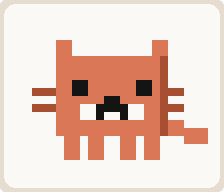<br><b>Котёнок-стажёр</b><br><sub>от 0</sub></td>
<td>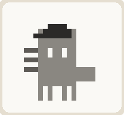<br><b>Кот-читатель</b><br><sub>от 25 000</sub></td>
<td>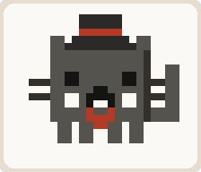<br><b>Кот-грепер</b><br><sub>от 100 000</sub></td>
<td>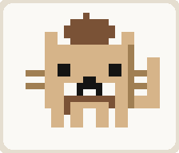<br><b>Кот-рефакторщик</b><br><sub>от 300 000</sub></td>
<td>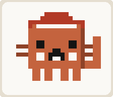<br><b>Кот-дебагер</b><br><sub>от 750 000</sub></td>
</tr>
<tr align="center">
<td><sub><i>«Мяу. А где тут README?»</i></sub></td>
<td><sub><i>«Я прочитал всё. Даже комментарии.»</i></sub></td>
<td><sub><i>«Оно в utils. Всегда в utils.»</i></sub></td>
<td><sub><i>«Этой абстракции здесь быть не должно.»</i></sub></td>
<td><sub><i>«Воспроизводится. Дальше дело техники.»</i></sub></td>
</tr>
<tr align="center">
<td>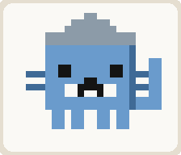<br><b>Кот-архитектор</b><br><sub>от 1 500 000</sub></td>
<td>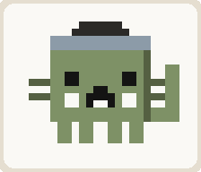<br><b>Кот-ревьюер</b><br><sub>от 3 000 000</sub></td>
<td>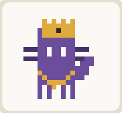<br><b>Кот-оркестратор</b><br><sub>от 6 000 000</sub></td>
<td>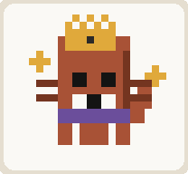<br><b>Кот-опус</b><br><sub>от 12 000 000</sub></td>
<td>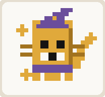<br><b>Квантовый кот</b><br><sub>от 25 000 000</sub></td>
</tr>
<tr align="center">
<td><sub><i>«Разложим на модули — и станет скучно. В хорошем смысле.»</i></sub></td>
<td><sub><i>«Здесь гонка. Вот сценарий.»</i></sub></td>
<td><sub><i>«Ты, ты и ты — по файлу каждому.»</i></sub></td>
<td><sub><i>«Тесты прошли. Все. Проверил дважды.»</i></sub></td>
<td><sub><i>«Пока ты не открыл PR, баг и есть, и нет.»</i></sub></td>
</tr>
</table>

Картинки в этой таблице печатает `npm run cats` тем же модулем, которым рисует мини-апп, — поэтому они не могут разойтись с тем, что видит пользователь.

### Достижения

👋 Первое слово · 🔧 Первый инструмент · ✏️ Правка пошла · 🖥️ Терминал открыт · 🛑 Нет — тоже ответ · 🌙 Ночная смена · 🔥 Неделя подряд · 💬 Сотня · 🎯 Миллион · ⏹️ Стоп-кран · 🗂️ Многостаночник · 🐈‍⬛ Предел

## Планы

| | 🌱 Free | ⚡ Pro | 🚀 Max |
|---|---|---|---|
| Модель | Haiku 4.5 | Sonnet 5 | Opus 5 |
| Токенов в сутки | 200 000 | 2 000 000 | 10 000 000 |
| Читает файлы | ✅ | ✅ | ✅ |
| Правит файлы | — | ✅ с подтверждением | ✅ |
| Bash | — | — | ✅ с подтверждением |
| Субагенты | — | — | ✅ |
| Режим «правки без вопросов» | — | ✅ | ✅ |

Это планы **бота**, а не подписка Anthropic: они описывают модель, лимиты и набор инструментов. Оплата в любом случае идёт по API-ключу — Agent SDK [не умеет работать от подписки claude.ai](https://code.claude.com/docs/en/agent-sdk/quickstart).

## Установка

Нужен Node 22.5 или новее — ради встроенного `node:sqlite`, чтобы на сервере не собирать нативные модули.

```bash
npm install
```

```bash
cp .env.example .env
```

```bash
npm run keygen
```

Полученную строку — в `ENCRYPTION_KEY`. Ею шифруются API-ключи в базе; сменишь ключ — все сохранённые придётся вводить заново.

Дальше заполнить `.env`:

- `BOT_TOKEN` — от [@BotFather](https://t.me/BotFather)
- `ALLOWED_USER_IDS` — свой Telegram id. **Пустое значение = бот отвечает кому угодно**, то есть отдаёт шелл на машине любому, кто его найдёт.
- `AUTH_MODE=owner` + `OWNER_ANTHROPIC_API_KEY` — бот личный, ключ один на всех
- `AUTH_MODE=byok` — каждый пользователь вводит свой ключ

```bash
npm run dev
```

## Команды

| Команда | Что делает |
|---|---|
| `/start` | приветствие и выбор плана |
| `/new` | начать диалог с чистого листа |
| `/stop` | остановить агента прямо сейчас |
| `/mode` | спрашивать каждый раз · правки молча · только план |
| `/plan` | сменить план и модель |
| `/project имя` | переключить рабочую папку |
| `/stats` | расход, серия, текущий кот |
| `/cats` | все коты и достижения |
| `/forgetkey` | удалить сохранённый API-ключ |

## Разработка

```bash
npx tsx --test test/logic.test.ts
```

Покрыто то, что ломается незаметно: шифрование ключей, проверка подписи `initData` (подделка пользователя, чужой токен, протухшие данные), семантика очереди streaming input, пороги уровней, обход каталога в именах проектов, разбиение длинных сообщений.

```bash
npm run miniapp
```

Поднимает мини-апп на `localhost:8788` — открывать с `?demo=1`, чтобы смотреть вёрстку без Telegram и подписанных данных.

```bash
npm run cats
```

Перерисовывает картинки котов для этого README.

## Устройство

```
src/
  config.ts         разбор .env, проверки на старте
  crypto.ts         AES-256-GCM для ключей, проверка подписи initData
  db.ts             node:sqlite — пользователи, чаты, расход, достижения
  tiers.ts          три плана
  cats.ts           10 котов и 12 достижений (общие для бота и мини-аппа)
  achievements.ts   когда что открывается
  agent/
    queue.ts        AsyncIterable для streaming input
    conversation.ts живой диалог: query(), учёт расхода, рендер шагов
    permissions.ts  мост canUseTool → кнопки Telegram
    render.ts       форматирование под Telegram HTML
  bot/
    onboarding.ts   /start, выбор плана, приём ключа
    keyboards.ts    инлайн-клавиатуры
    output.ts       отправка, строка состояния, карточки разрешений
    session.ts      chatId → живой диалог, бюджеты, папки проектов
  miniapp/
    server.ts       статика + /api/profile с проверкой initData
    public/
      cat-art.js    рисование котов — общее с генератором картинок
```

### Три места, где легко ошибиться

**Расход токенов накопительный.** `total_cost_usd` и `modelUsage` в streaming-сессии приходят как итог с начала сессии, а не за ход. Суммирование по всем `result` завысило бы расход в разы, поэтому `Conversation` хранит прошлый итог и пишет в статистику разницу.

**`canUseTool` нельзя оставить без ответа.** Возврат `null` — это fail-closed: вызов инструмента блокируется навсегда, без ошибки и без таймаута. Поэтому у каждого запроса есть таймаут, обработчик `abort` и аварийный отказ, если карточку не удалось отправить.

**`MainButton` существует и вне Telegram.** `telegram-web-app.js` создаёт объект в любом браузере, где кнопка — заглушка, которая ничего не рисует. Проверять её наличие бесполезно; настоящий клиент опознаётся по заполненным `initData` или по `platform !== "unknown"`.

## Безопасность

- API-ключи шифруются AES-256-GCM; сообщение с ключом удаляется из чата сразу после приёма и в логи не попадает.
- `ALLOWED_USER_IDS` — единственное, что отделяет бота от произвольного выполнения кода на машине.
- Имена проектов санируются; рабочая папка не может выйти за пределы каталога пользователя.
- Mini App отдаёт данные только по валидной подписи `initData` со сроком годности сутки.
- Агент работает внутри `WORKSPACE_ROOT`, а не в корне файловой системы.

## Доступность

Мини-апп проверен по WCAG 2.2 AA: контраст текста не ниже 4.91:1 в светлой теме и 6.21:1 в тёмной при норме 4.5, статусы переданы словом, а не только цветом, прогресс-бар объявляется фразой целиком, все иллюстрации помечены декоративными, тач-таргеты не меньше 44 px.

Цвета карточек намеренно **не** выводятся из `--tg-theme-*`: тема Telegram задаётся клиентом и может быть какой угодно, поэтому ей отдан только фон страницы.

Фирменная глина `#D97757` даёт на креме всего 3.0:1 — для текста мало. Поэтому коты рисуются чистой глиной, а текст и полосы берут затемнённый вариант того же тона.

## Деплой

Бот работает на long polling — белый IP и вебхук не нужны. Для Mini App понадобится HTTPS-адрес.

```bash
npm run build
```

```bash
node --experimental-sqlite dist/index.js
```
